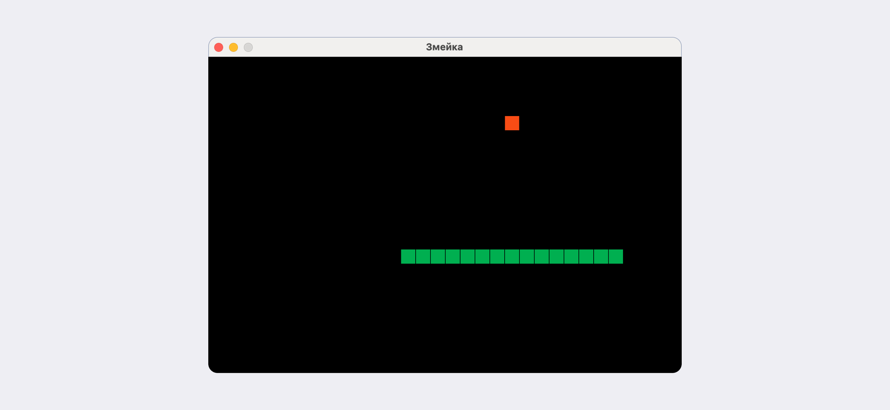
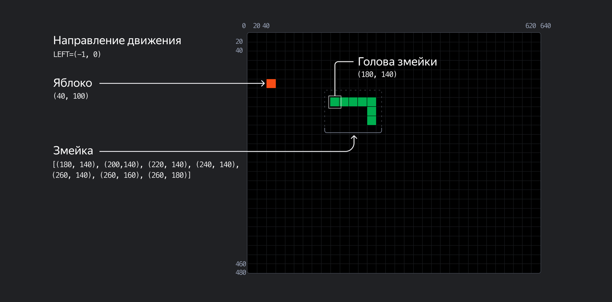
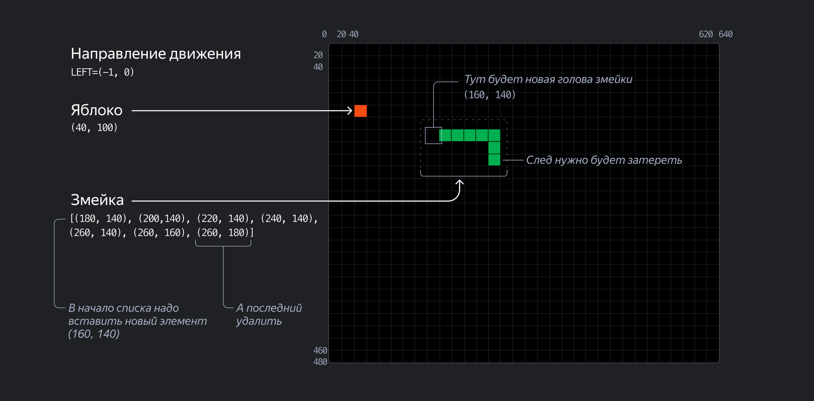

# the_snake

<!-- ОТКРЫТЬ ДАННЫЙ ФАЙЛ В РЕЖИМЕ ПРОСМОТРА в VSCode - CTRL+SHIFT+V -->

### Критерии оценивания
Чтобы получить оценку __выше 2__, нужно на паре ответить на любые вопросы по сделанной домашней работе, в рамках пройденного материала на парах.

Для допуска к вопросам по сделанной работе:
- __Для оценки 3__ проект нужно уметь развернуть на любом предложенном ПК, основная логика игры должна соответствовать заданию.
- __Для оценки 4__: все что для оценки 3 + полностью выполненная логика игры.
- __Для оценки 5__: всё что для оценки 4 + профессионально оформленный код.

### С чего начать
В репозитории the_snake лежит файл для домашнего задания, который называется the_snake.py, набор автоматических тестов и некоторое количество служебных директорий и файлов.  

  └── the_snake

    ├── tests
    │   ├── conftest.py
    │   ├── test_code_structure.py
    │   └── test_main.py
    ├── .gitignore
    ├── README.md
    ├── pytest.ini
    ├── requirements.txt
    ├── setup.cfg
    └── the_snake.py  <-- Пишите код в этом файле    

В директории the_snake разверните и активируйте виртуальное окружение.

__Команда для Windows:__

- python -m venv venv
- source venv/Scripts/activate

__Команда для Linux и macOS:__  

- python3 -m venv venv
- source venv/bin/activate 

Содержимое директории с проектом должно стать таким:

    ├── tests/
    ├── venv/      <-- Здесь должна появиться папка с виртуальным окружением
    ├── .gitignore
    ├── README.md
    ├── pytest.ini
    ├── requirements.txt
    ├── setup.cfg
    └── the_snake.py  <-- Пишите код в этом файле 

__Установите зависимости проекта:__

- pip install -r requirements.txt 

### Теперь всё готово, можно начать выполнять домашнее задание!

## Проверка и работа над ошибками
После того как задание будет выполнено, проверьте свою работу линтером на соответствие правилам оформления кода. Это можно сделать через редактор кода, либо через терминал, выполнив команду flake8 из директории проекта dev/the_snake.
После этого из директории проекта запустите команду pytest: автоматические тесты, написанные для задания, проверят, правильно ли работает ваш код. Убедитесь, что тесты проходят успешно.
Если линтер или тесты обнаружат ошибку, исправьте код и вновь выполните обе проверки.

  

# Описание
Вам предстоит написать на Python классическую игру «Змейка». Игру можно написать по-разному; ваше решение должно быть реализовано на принципах ООП. 
Ваша задача — реализовать часть логики игры, написать необходимые классы, их атрибуты и методы. А мы предоставим вам базовый графический интерфейс и заготовку основного игрового цикла. 

## Проект «Изгиб Питона»
Классическая компьютерная игра «Змейка» является одной из самых известных в мире игр. Простые правила, минималистичный дизайн и драйв — причины популярности этой игры на протяжении многих лет: прототип был придуман в 1976 году, а первая «Змейка», которую мы знаем, — в 1995-м.
Суть игры заключается в том, что игрок управляет змейкой, которая движется по игровому полю, разделённому на клетки.
Цель игры — увеличивать длину змейки, «съедая» появляющиеся на экране яблоки (часто изображаемые в виде точек или других символов).

## Правила игры
- Змейка состоит из сегментов.
- Змейка движется в одном из четырёх направлений — вверх, вниз, влево или вправо. Игрок управляет направлением движения, но змейка не может остановиться или двигаться назад.
- Каждый раз, когда змейка съедает яблоко, она увеличивается в длину на один сегмент.
- В классической версии игры столкновение змейки с границей игрового поля приводит к проигрышу. Однако в некоторых вариациях змейка может проходить сквозь одну стену и появляться с противоположной стороны поля. У вас будет именно так.
- Если змейка столкнётся сама с собой — игра начинается с начала.

## Общая логика и компоненты игры
Игровое поле — это прямоугольник чёрного цвета размером 640 на 480 точек, разделённый на ячейки.
Ячейка — это квадрат размером 20 на 20 точек. Таким образом, игровое поле имеет размер 32 ячейки по горизонтали и 24 по вертикали. 
У каждой ячейки есть координаты. Отсчёт координат начинается с левого верхнего угла игрового поля. Самая первая ячейка — это ячейка с координатами 0, 0. Координаты каждой ячейки определяются координатами её верхнего левого угла.
Змейка и яблоко — это объекты, которые создаются и отрисовываются на игровом поле.

Яблоко — это просто квадрат размером в одну ячейку игрового поля. При создании яблока координаты для него определяются случайным образом и сохраняются до тех пор, пока змейка не «съест» яблоко. После этого для яблока вновь задаются случайные координаты.

Змейка изначально состоит из одной головы — из одной ячейки на игровом поле. Змейка постоянно куда-то ползёт и после того, как «съест» яблоко, вырастает на один сегмент. При запуске игры змейка сразу же начинает движение вправо по игровому полю.

Описать змейку проще всего списком, в котором каждый элемент — это сегмент змейки. Значение элемента списка — это координаты сегмента на игровом поле.
Координаты удобно представить через кортеж. При размере ячейки 20×20:
 - У яблока могут быть координаты, например, (40, 340).
 - Змейка, состоящая только из одной головы, может быть представлена списком [(20, 240)]. Если змейка состоит из двух сегментов, она может быть описана списком [(20, 240), (40, 240)].

Отрисовать яблоко на игровом поле — нарисовать квадрат, залитый цветом, размером в одну ячейку по указанным координатам.
Отрисовать змейку — означает отрисовать столько квадратов, сколько элементов есть в списке с координатами.

Изменить положение змейки на одну ячейку — означает вставить в начало списка новый элемент с новыми координатами головы и удалить последний элемент списка. 

Событие «змейка съела яблоко» — состояние, когда координаты головы змейки совпали с координатами яблока.

### Код игры состоит из нескольких основных частей:
1. Инициализация Pygame и настройка игрового окна. В начале программы настраиваются основные параметры игры, такие как размеры окна и цвет фона. Создаётся окно игры с заданными размерами, устанавливается заголовок окна.
2. Классы игровых объектов:
    - GameObject — это базовый класс, от которого наследуются другие игровые объекты. Он содержит общие атрибуты игровых объектов — например, эти атрибуты описывают позицию и цвет объекта. Этот же класс содержит и заготовку метода для отрисовки объекта на игровом поле — draw.
    - Snake — класс, унаследованный от GameObject, описывающий змейку и её поведение. Этот класс управляет её движением, отрисовкой, а также обрабатывает действия пользователя.
    - Apple — класс, унаследованный от GameObject, описывающий яблоко и действия с ним. Яблоко должно отображаться в случайных клетках игрового поля.
3. Логика игры:
    - Сначала создаются необходимые объекты.
    - В основном цикле игры (в функции main) происходит обновление состояний объектов: змейка обрабатывает нажатия клавиш и двигается в соответствии с выбранным направлением.
    - Если змейка съедает яблоко, её размер увеличивается на один сегмент, а яблоко перемещается на новую случайную позицию.
    При столкновении змейки с самой собой игра начинается заново.
4. Отрисовка объектов. В каждой итерации цикла змейка меняет своё положение на игровом поле на одну ячейку. По факту это означает, что в списке координат, описывающем змейку, добавляется новый элемент (новая голова в начале списка с новыми координатами) и удаляется последний. Координаты для нового элемента определяются в зависимости от направления движения.
После удаления координат хвостового сегмента из списка, описывающего змейку, ячейка, с которой она «уползла», останется закрашена в цвет змейки. После отрисовки змейки по обновлённым координатам следует «затирать её след» — то есть отрисовывать чёрный (по цвету игрового поля) квадрат по координатам удалённого последнего сегмента.

5. Обновление экрана. На каждой итерации цикла while программа вычисляет новое состояние игрового поля: определяет координаты каждого сегмента змейки и, при необходимости, координаты яблока, а также проверяет, не столкнулась ли змейка сама с собой. После выполнения всех вычислений вызывается функция pygame.display.update(), которая обновляет игровое поле на экране пользователя. Отображение игрового поля обновляется на каждой итерации цикла.
    - Однако, если программа будет отрисовывать изменения игрового поля с той скоростью, на которую способен компьютер, змейка будет перемещаться по экрану столь быстро, что игрок не сможет ей управлять.

    - Чтобы замедлить «течение событий», в Pygame применяется метод clock.tick(N): он изменяет выполнение кода так, что итерации цикла будут выполняться не чаще чем N раз в секунду. В прекоде метод clock.tick() вызван с аргументом 20, это означает, что положение змейки на экране будет изменяться не более 20 раз в секунду.

Игра продолжается в бесконечном цикле, пока пользователь не закроет окно.

# Классы и методы
### 1. Класс GameObject:

__Атрибуты:__
- position — позиция объекта на игровом поле. В данном случае она инициализируется как центральная точка экрана.
- body_color — цвет объекта. Он не задаётся конкретно в классе GameObject, но предполагается, что будет определён в дочерних классах.

__Методы:__
- \__init__ — инициализирует базовые атрибуты объекта, такие как его позиция и цвет.
- draw — это абстрактный метод, который предназначен для переопределения в дочерних классах. Этот метод должен определять, как объект будет отрисовываться на экране. По умолчанию — pass.

### 2. Класс Apple, наследуется от GameObject:

__Атрибуты:__

- body_color — цвет яблока. В данном случае задаётся RGB-значением (красный цвет — (255, 0, 0)).
- position — позиция яблока на игровом поле. Яблоко появляется в случайном месте на игровом поле.

__Методы:__

- \__init__ — задаёт цвет яблока и вызывает метод randomize_position, чтобы установить начальную позицию яблока.
- randomize_position — устанавливает случайное положение яблока на игровом поле — задаёт атрибуту position новое значение. Координаты выбираются так, чтобы яблоко оказалось в пределах игрового поля.
- draw — отрисовывает яблоко на игровой поверхности (есть в прекоде).

### 3. Класс Snake, наследуется от GameObject:

Программно змейка — это список координат, каждый элемент списка соответствует отдельному сегменту тела змейки. Атрибуты и методы класса обеспечивают логику движения, отрисовку, обработку событий (нажата клавиша) и другие аспекты поведения змейки в игре.

__Атрибуты:__

- length — длина змейки. Изначально змейка имеет длину 1.
- positions — список, содержащий позиции всех сегментов тела змейки. Начальная позиция — центр экрана.
- direction — направление движения змейки. По умолчанию змейка движется вправо.
- next_direction — следующее направление движения, которое будет применено после обработки нажатия клавиши. По умолчанию задать None.
- body_color — цвет змейки. Задаётся RGB-значением (по умолчанию — зелёный: (0, 255, 0)).

__Методы:__

- \__init__ — инициализирует начальное состояние змейки.
- update_direction — обновляет направление движения змейки (есть в прекоде).
- move — обновляет позицию змейки (координаты каждой секции), добавляя новую голову в начало списка positions и удаляя последний элемент, если длина змейки не увеличилась.
- draw — отрисовывает змейку на экране, затирая след (есть в прекоде).
- get_head_position — возвращает позицию головы змейки (первый элемент в списке positions).
- reset — сбрасывает змейку в начальное состояние.

# Функции

- handle_keys — обрабатывает нажатия клавиш, чтобы изменить направление движения змейки __(есть в прекоде).__

# Основной игровой цикл

__Создание экземпляров классов Snake и Apple до цикла.__

__В бесконечном цикле:__

- Обрабатывайте события клавиш при помощи функции handle_keys().
- Обновляйте направление движения змейки при помощи метода update_direction().
- Двигайте змейку (модифицируйте список) при помощи метода move().
- Проверяйте, съела ли змейка яблоко (если да, увеличьте длину змейки и переместите яблоко).
- Проверяйте столкновения змейки с собой (если столкновение, сброс игры при помощи метода reset()).
- Отрисовывайте змейку и яблоко, используя соответствующие методы draw.
- Обновляйте экран при помощи метода pygame.display.update().

# Задание

- Напишите классы GameObject, Apple и Snake, а также их атрибуты и методы.
- Допишите основной цикл игры в функции main().
- Всё, к чему можно написать докстринги, должно содержать докстринги.
- Код должен соответствовать PEP 8.

### Игра должна запускаться и работать, согласно правилам игры, без ошибок.

## Дополнительные опции, которые не проверяются тестами

Эти опции не входят в обязательную часть задания, и их можно проигнорировать. Однако, если у вас есть время и желание, лишняя практика не повредит.

- Цвета и скорость игры можно настроить по вашему усмотрению.
- Генерировать можно не только яблоко, но и «неправильную» еду. Если змейка съест неправильный корм, её длина уменьшается на один сегмент.
- На игровом поле могут появляться препятствия в виде «камня» размером в одну ячейку. При столкновении с камнем змейка принимает исходное состояние.

# Подсказки

-  Вставлять новый элемент в список можно методом insert(), а удалять — методом pop().
- Для генерации случайных координат яблока можно использовать следующее выражение: randint(0, ширина_или_высота_сетки) * GRID_SIZE.
- При описании инициализатора класса можно не только перечислять атрибуты и их значения по умолчанию, но и сразу запускать методы класса. Это может быть полезно при определении начальной позиции яблока.
- Центральную точку экрана можно определить так: ((SCREEN_WIDTH // 2), (SCREEN_HEIGHT // 2)). Это может быть полезным при описании базового класса GameObject.

- Метод move в классе Snake отвечает за обновление положения змейки в игре. Вот как работает его логика:

    1. __Получение текущей головной позиции:__

        - Метод начинается с вызова get_head_position, который возвращает текущее положение головы змейки (первый элемент в списке positions).

    2. __Вычисление новой позиции головы:__

        - На основе текущего направления движения (self.direction) метод вычисляет новую позицию головы. Направление представляет собой пару значений (dx, dy), которые добавляются к текущим координатам головы.
        - При этом учитывается размер сетки (GRID_SIZE), чтобы голова переместилась на одну ячейку в соответствующем направлении.
        - Также применяется обработка краёв экрана: если змейка достигает края экрана, она появляется с противоположной стороны (с помощью операции модуля по ширине и высоте экрана).

    3. __Обновление списка позиций:__

        - Новая позиция головы вставляется в начало списка positions.
        - Затем проверяется, превышает ли текущая длина змейки её максимальное значение (self.length). Если да, последний элемент списка удаляется, имитируя движение змейки. Если нет, это означает, что змейка только что съела яблоко, и её длина увеличивается, поэтому последний элемент списка оставляется.

- Метод reset в классе Snake отвечает за сброс змейки в начальное состояние после столкновения с собой или другого события, требующего перезапуска змейки. Вот как работает его логика:

    1. __Сброс длины змейки:__

        - Длина змейки (self.length) устанавливается равной 1. Это возвращает змейку к её начальному размеру, который был при инициализации.

    2. __Сброс позиций змейки:__

        - Список позиций (self.positions) сбрасывается так, чтобы он содержал только начальную позицию змейки. Начальная позиция — центральная точка игрового поля.

    3. __Изменение направления движения:__

        - Движение змейки (self.direction) устанавливается в одном из четырёх возможных направлений (вверх, вниз, влево, вправо) случайным образом. Это делается для того, чтобы при каждой новой игре змейка начинала движение в различном направлении.
    
    В результате выполнения метода reset змейка возвращается в своё начальное состояние, как если бы игра только началась.
- Атрибут self.last в классе Snake используется для хранения позиции последнего сегмента змейки перед тем, как он исчезнет (при движении змейки). Это необходимо для «стирания» этого сегмента с игрового поля, чтобы змейка визуально двигалась. Вы можете инициализировать self.last как None в методе __init__ класса Snake. Это покажет, что изначально у змейки нет «последнего сегмента», который нужно стереть с поля.
- Экран можно очистить методом screen.fill(), заполнив его фоновым цветом (BOARD_BACKGROUND_COLOR). Это удаляет оставшиеся части змейки с экрана, подготавливая его к новой игре.# thesnaketenza

